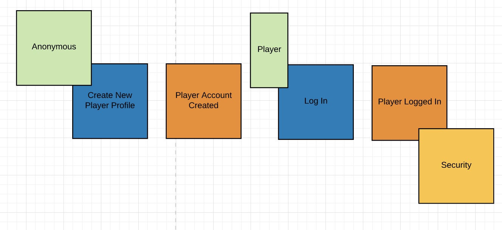

# Splendor Client

Introduction
------------

Hi :smiley:. Some time ago during a board games session with my team I came up with the idea of implementing such a game in 
php. The main reason for this initiative was pretty simple I want to practise event storming and figure out how to combine domain driven design with behaviour driven development (user stories).
You may ask why board games? In my opinion they are great to practise domain driven design cuz theirs domain is formalized via manual. 
Later on I thought that actually It will be a cool idea to share these practise sessions with you.

Event storming
--------------
 - [Big picture](https://www.lucidchart.com/invitations/accept/e43b9aba-7c2b-464f-99c1-78278a18fac2)

Episodes
--------

1. Creating Player Profiles

2. Creating & Joining Games

The Domain
----------

[The Splendor manual](/docs/media/Rules_Splendor_US.pdf)
